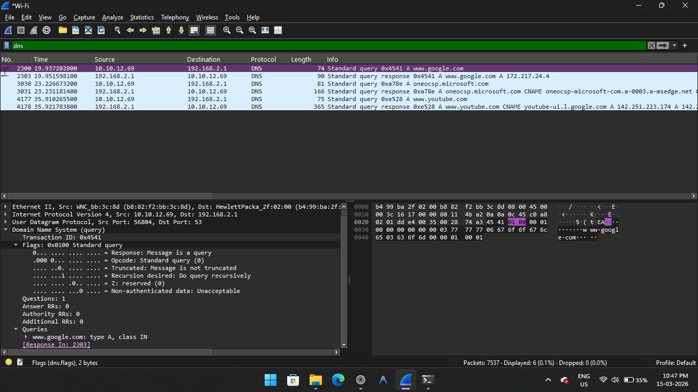
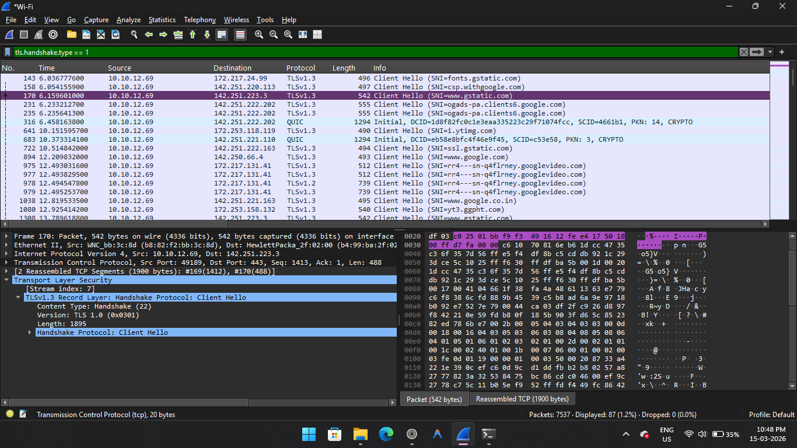
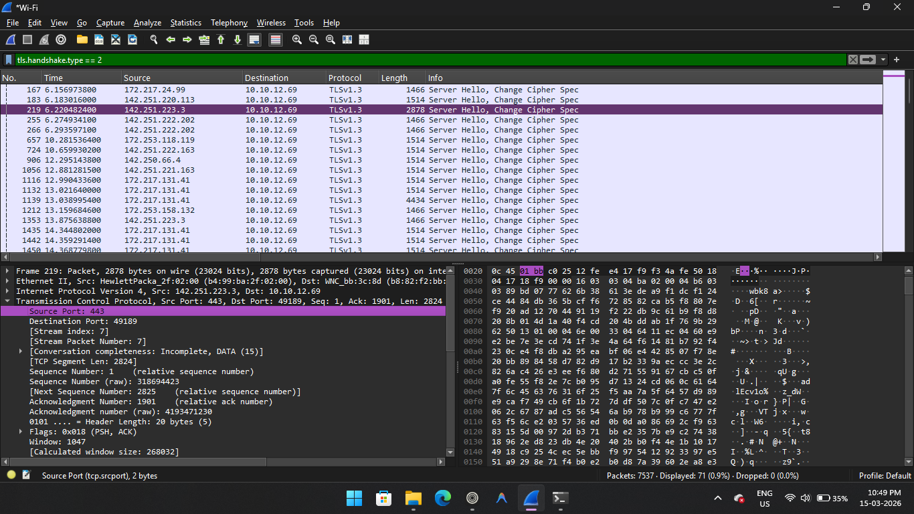
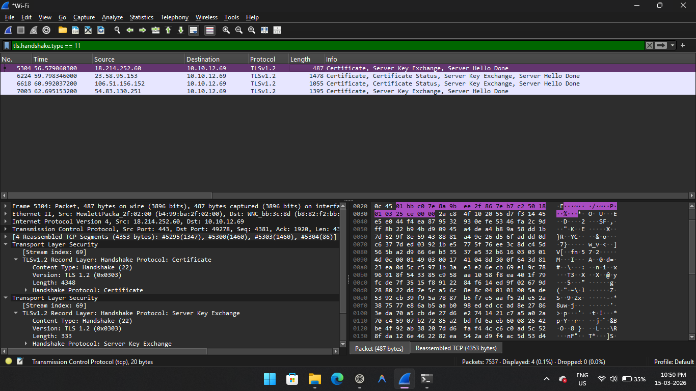
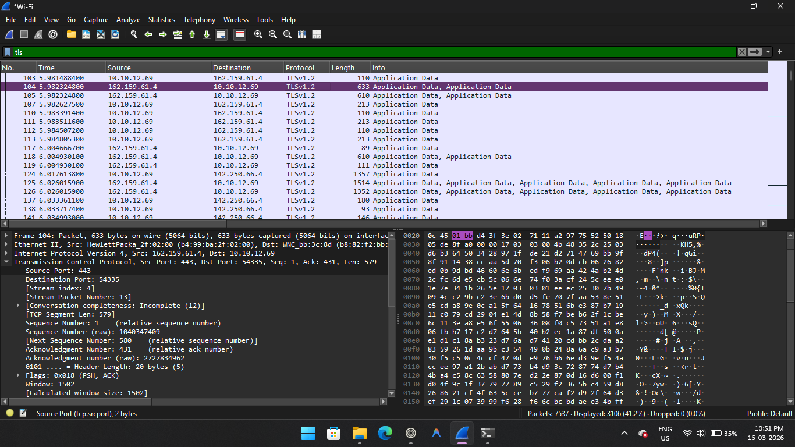

# Wireshark TLS Encryption Traffic Analysis

## Overview

This project analyzes encrypted network traffic using Wireshark. The goal is to understand how secure HTTPS communication is established through the TLS handshake process.

During the packet capture, several network protocols were observed including DNS, TCP, and TLS. The analysis focuses on how a client and server establish a secure connection before exchanging encrypted data.

## Tools Used

* Wireshark
* Web Browser
* Windows Operating System

## Key Analysis

The captured traffic demonstrates the following network activities:

* DNS queries used to resolve domain names into IP addresses
* TCP three-way handshake used to establish a connection
* TLS handshake including Client Hello, Server Hello, and certificate exchange
* Encrypted application data after the TLS session is established

## Conclusion

This project demonstrates how modern web communication uses TLS encryption to protect data between clients and servers. By analyzing the packet capture in Wireshark, it is possible to observe the handshake process that enables secure HTTPS connections.

## DNS Query

DNS resolves a domain name into an IP address.

---

## TLS Client Hello

The client starts the TLS handshake by sending supported encryption methods.

---

## TLS Server Hello

The server responds by selecting a cipher suite.

---

## TLS Certificate

The server sends its digital certificate for authentication.

---

## Encrypted TLS Traffic

After the handshake, all communication becomes encrypted.

